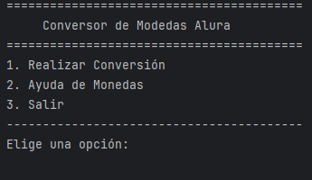
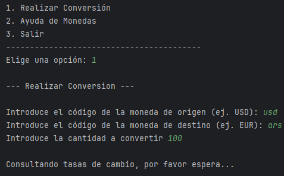
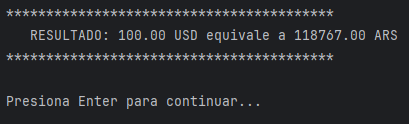
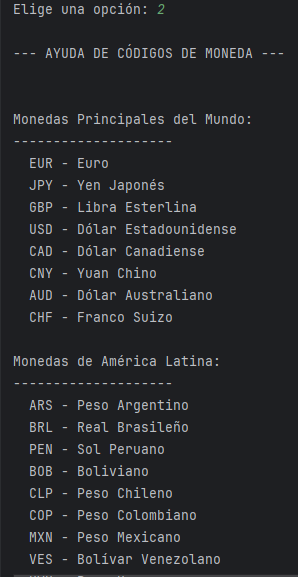

# 🚀 Conversor de Moneda para Consola

Este proyecto es un conversor de moneda interactivo que se ejecuta en la consola. Fue desarrollado como parte del Challenge de Back-End de **Alura Latam**, utilizando **Java 21**.

La aplicación permite al usuario obtener tasas de cambio en tiempo real, realizar conversiones entre distintas divisas y consultar una lista de las monedas más importantes como referencia. Todo esto a través de una interfaz de usuario de consola limpia y fácil de usar.

## ✨ Características Principales

*   **Conversión en Tiempo Real:** Utiliza la API de [ExchangeRate-API](https://www.exchangerate-api.com/) para obtener las tasas de cambio más recientes.
*   **Gestión Segura de Credenciales:** Usa la librería `java-dotenv` para cargar la clave de la API desde un archivo `.env`, evitando exponerla en el código fuente.
*   **Menú Interactivo:** Una interfaz de usuario de consola que guía al usuario a través de las opciones de forma intuitiva.
*   **Validación de Entradas:** Maneja entradas no numéricas para prevenir errores en tiempo de ejecución.
*   **Manejo de Errores de API:** Informa al usuario si un código de moneda no es válido o si hay un problema al contactar el servicio.
*   **Sección de Ayuda:** Muestra una lista de códigos de monedas comunes para facilitar su uso.

## 📸 Capturas de Pantalla

**1. Menú Principal**



**2. Proceso de Conversión**



**3. Resultado**



**4. Sección de Ayuda**




## 🛠️ Tecnologías Utilizadas

*   **Lenguaje:** Java 21
*   **IDE de Desarrollo:** IntelliJ IDEA
*   **Librerías:**
    *   **Gson:** Para deserializar (parsear) la respuesta JSON de la API de forma eficiente.
    *   **Java Dotenv:** Para gestionar variables de entorno y mantener la clave de la API segura y fuera del código fuente.
*   **API:**
    *   **Java HTTP Client:** El cliente HTTP moderno y estándar de Java (incluido desde JDK 11) para realizar las peticiones a la API.
    *   **ExchangeRate-API:** El servicio externo que proporciona los datos de tasas de cambio.

## ⚙️ Instalación y Uso

Para ejecutar este proyecto en tu máquina local usando IntelliJ IDEA, sigue estos pasos:

**1. Prerrequisitos:**
*   Tener instalado el **JDK (Java Development Kit)**, versión 21 o superior.
*   Tener instalado **IntelliJ IDEA**.

**2. Clonar el repositorio:**
```bash
git clone https://github.com/tu-usuario/tu-repositorio.git
```

**3. Abrir el proyecto en IntelliJ IDEA:**
*   Abre IntelliJ IDEA.
*   Selecciona `File` > `Open...` y navega hasta la carpeta que acabas de clonar.

**4. Configurar la Clave de API con `.env`:**
*   En la raíz del proyecto, crea un nuevo archivo llamado `.env`.
*   Dentro de este archivo, añade la siguiente línea, reemplazando el texto con tu clave de API real:

    ```
    API_KEY="AQUI_VA_TU_CLAVE_DE_API"
    ```

**5. Ejecutar la aplicación:**
*   Navega hasta el archivo `Main.java` en la estructura del proyecto.
*   Haz clic derecho en el archivo y selecciona `Run 'Main.main()'`. También puedes usar el icono de reproducción verde (▶️) que aparece junto al método `main`.

¡Y listo! La aplicación se iniciará en la pestaña `Run` de IntelliJ IDEA.

## 👨‍💻 Autor

   **[Miguel Juárez](https://github.com/miguell29)**